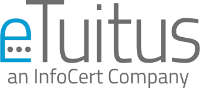

# 🍽️ UnisaEat

  

  
  

**UnisaEat** is an Android application that simplifies cafeteria experience for university students. 📱🍕🥗

## 🏆 App Contest 24/25 Winner  

UnisaEat won the **App Contest 2024-2025**, an application development competition for students of the **Mobile Programming** course at the University of Salerno.  

The contest was organized in collaboration with **eTuitus**, which sponsored the event and provided the prize. The project was evaluated based on:  

- 💡 **Originality of the idea**  
- 🔍 **App complexity**  
- 🖥️ **Code quality**  
- 🎨 **Usability of the final product**  

The judging panel, composed of the course professor and eTuitus developers, awarded UnisaEat as the best project of the competition. 🏅📱

Check out the presentation [here](docs/Presentazione.pdf)

---

## 📌 Main Features

- 🔑 **Authentication** with user login and registration  
- 🥗 **Daily menu view** for the university cafeteria  
- 💳 **Payment and credit top-up management**  
- 📅 **Orders** for in-place pickup of meals
- 📜 **Transaction history**
- 📷 **QR Code scanning** for user identification and faster payments  

## 🚀 Technologies Used

- **Android** (Java, MVVM, Retrofit)  
- **Backend server side**: Flask + MariaDB on Raspberry Pi with ZeroTier🍓  
- **REST API**: Retrofit for backend communication  

## 👨‍💻 Developers

giuseppe.pastena23@gmail.com
pasqualemuraca2003@gmail.com